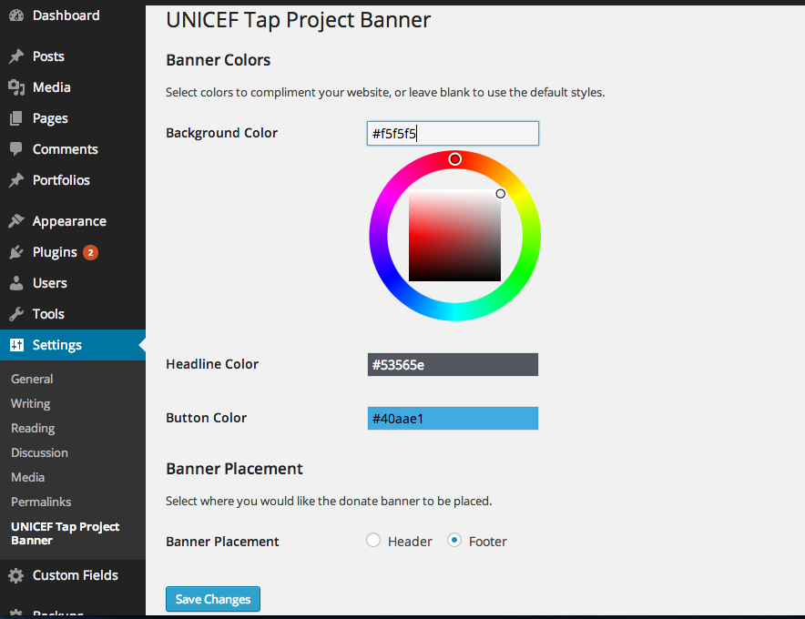
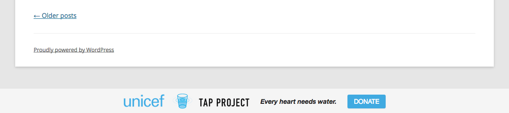

<!-- DO NOT EDIT THIS FILE; it is auto-generated from readme.txt -->
# UNICEF Tap Project Banner

Display a banner on your website encouraging visitors to donate to the UNICEF Tap Project.

**Contributors:** [adamcarter](http://profiles.wordpress.org/adamcarter), [fjarrett](http://profiles.wordpress.org/fjarrett)  
**Tags:** [charity](http://wordpress.org/plugins/tags/charity), [donations](http://wordpress.org/plugins/tags/donations), [donate](http://wordpress.org/plugins/tags/donate), [unicef](http://wordpress.org/plugins/tags/unicef), [clean water](http://wordpress.org/plugins/tags/clean water)  
**Requires at least:** 3.5  
**Tested up to:** 3.9.1  
**Stable tag:** trunk (master)  
**License:** [GPLv2 or later](http://www.gnu.org/licenses/gpl-2.0.html)  

## Description ##

Displays a simple donate banner in the header or footer of your website so your visitors can participate in giving to the UNICEF Tap Project.

Learn more at https://thewaterproject.org/

By displaying this banner on your website you are agreeing to the [UNICEF linking guidelines](http://www.unicef.org/about/legal_linking.html). This plugin is in no way officially affiliated with UNICEF.

**Development of this plugin is done [on GitHub](https://github.com/Magnacarter/unicef-tap-project-banner). Pull requests welcome. Please see [issues](https://github.com/Magnacarter/unicef-tap-project-banner/issues) reported there before going to the plugin forum.**

## Screenshots ##

### Customizable colors so the banner will compliment your website. Choose placement in the header or footer.

### Example of banner in the header.

### Example of banner in the footer.

## Changelog ##

### 0.1.0 - August 29, 2014 ###
Initial release!

